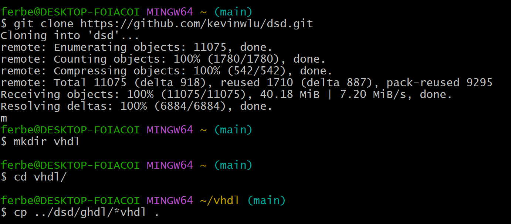
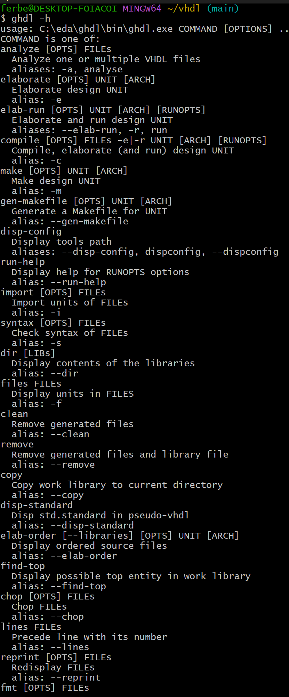
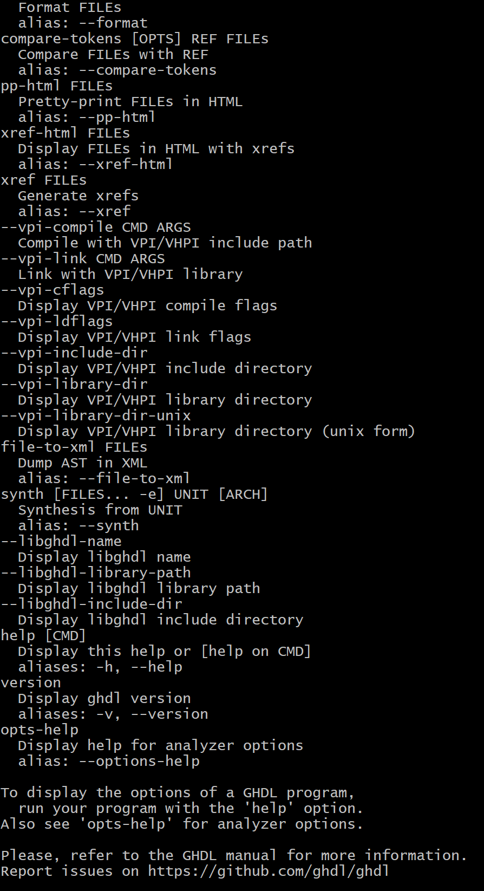
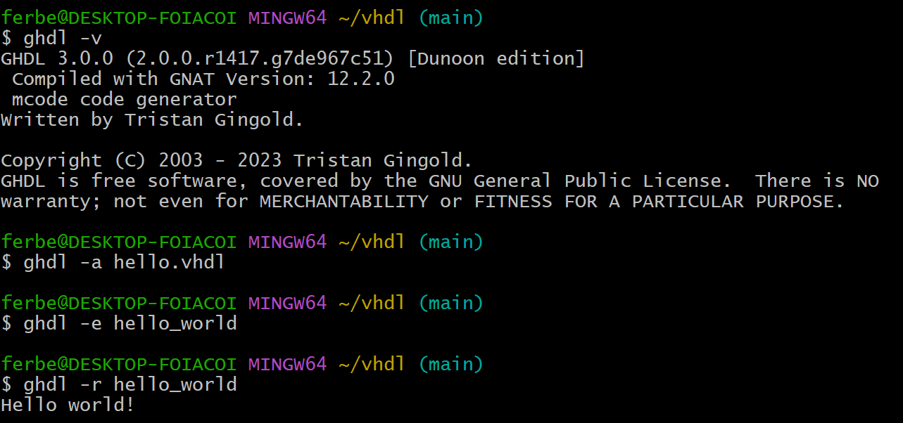
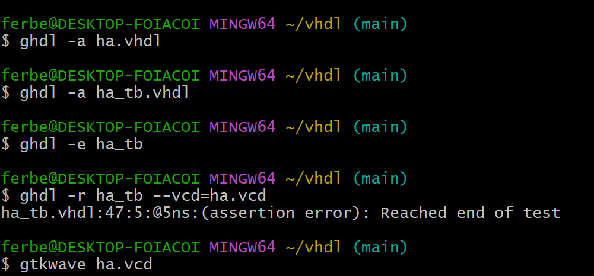
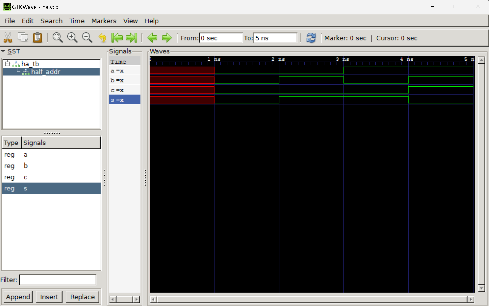
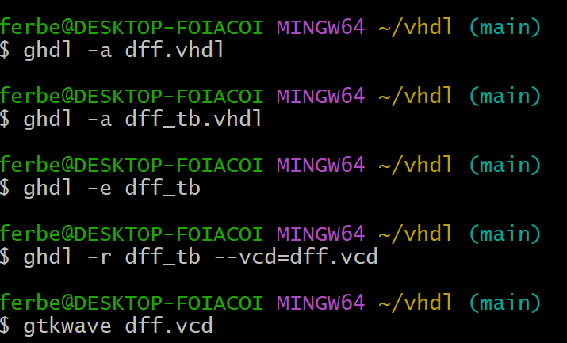
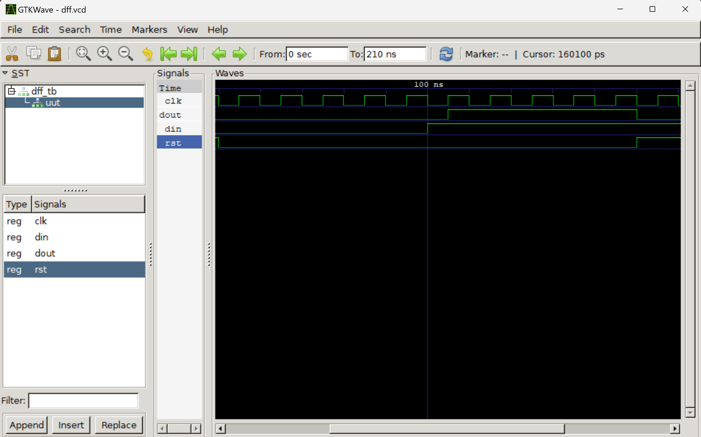

# CPE 322 - Lab 01

For this lab, I downloaded GTKWave and GHDL to run a Half Adder and D Flip-Flop based on the instructor's repository.

## Quick Start

## Hello, World Example

## Half Adder

## D Flip-Flop

