# CPE 322 - Lab 02

The purpose of this lab was to learn about the command line commands.

## Results of Commands

* ```$ hostname```
  * Prints the system's host name\
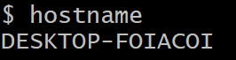
* ```$ env```
  * Shows the environment variables the user has created
* ```$ ps```
  * Displays the active processes happening on the system
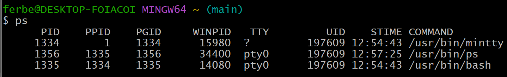
* ```$ pwd```
  * Displays the current working directory\
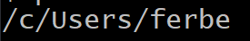
* ```$ git clone https://github.com/kevinwlu/iot.git```
  * Clones the repository from the GitHub url to the current working directory
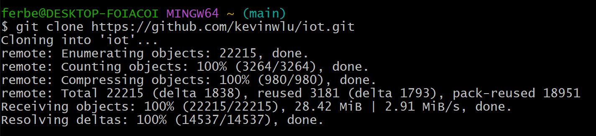
* ```$ cd iot```
  * Changes the current working directory into the target (in this case it becomes the iot directory)
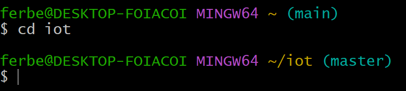
* ```$ ls```
  * Shows all files and directories within the current working directory
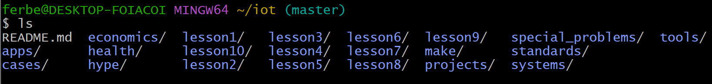
* ```$ cd```
  * Moves the current working directory back one. From ~/iot to ~
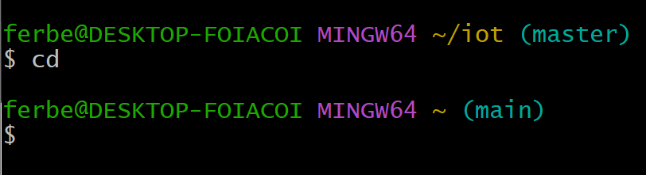
* ```$ df```
  * Displays the total space taken up on the drive as well as how much is left
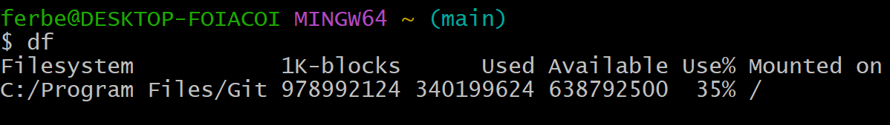
* ```$ mkdir demo```
  * Creates new directory named 'demo' in the current working directory
* ```$ cd demo```
  * Changes the current working directory to the target (demo in this case)
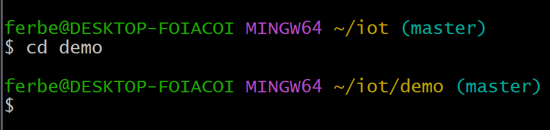
* ```$ nano file```
  * Opens nano text editor that can create or change files

* ```$ cat file```
  * Renders content in the file just created using the nano terminal
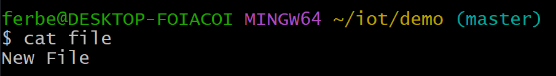
* ```$ cp file file1```
  * Copies the content of 'file' into a new file titled 'file1'
* ```$ mv file file2```
  * Moves/renames the first file to the second file (file &rarr; file2 in this case)
* ```$ rm file2```
  * Removes file2 from the current directory
* ```$ clear```
  * Clears the current terminal window
* ```$ man uname```
  * Displays user manual for the uname command (I believe ```man``` is a UNIX command and does not work on windows, so I used ```uname --help```)
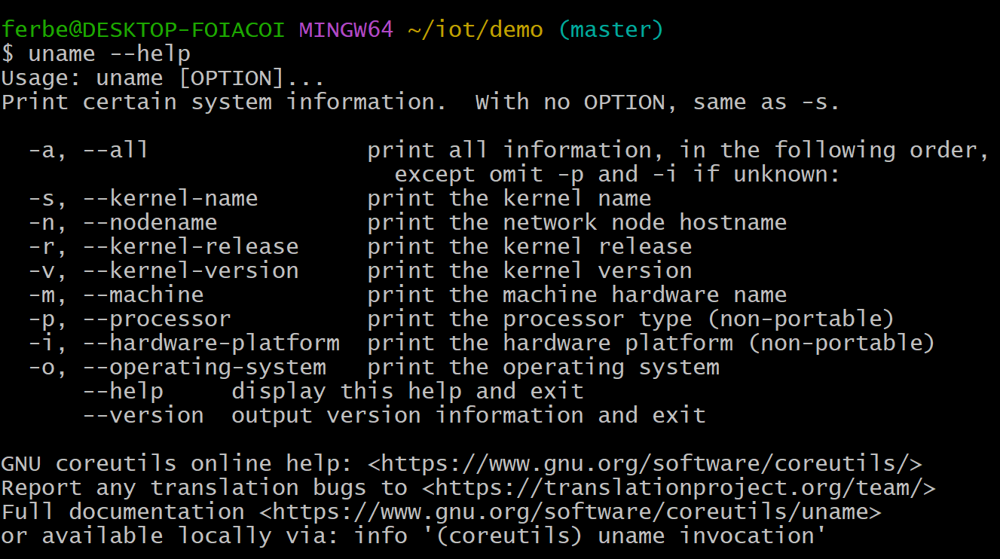
* ```$ uname -a```
  * Prints all information about the system
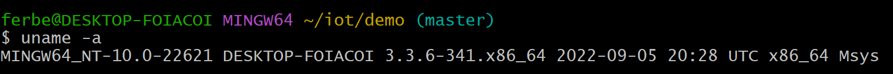
* ```$ ifconfig```
  * Displays the configuration of the network interface (This is a mac command, on windows I used ```$ ipconfig```)
* ```$ ping localhost```
  * Tests network requests to the local system and returns statistics on packets sent and received and approximate round trip times
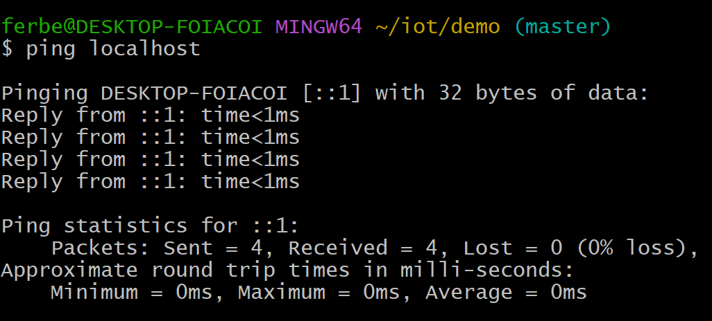
* ```$ netstat```
  * Generates displays that show network status and protocol statistics on the current network
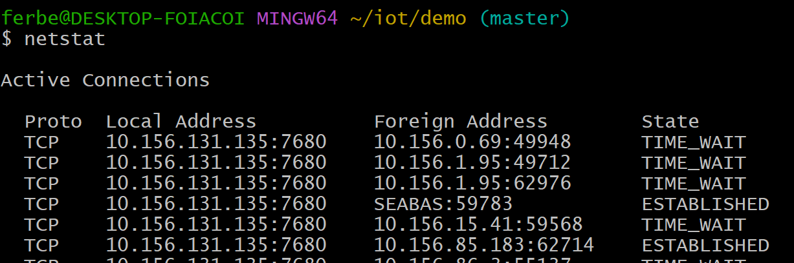
