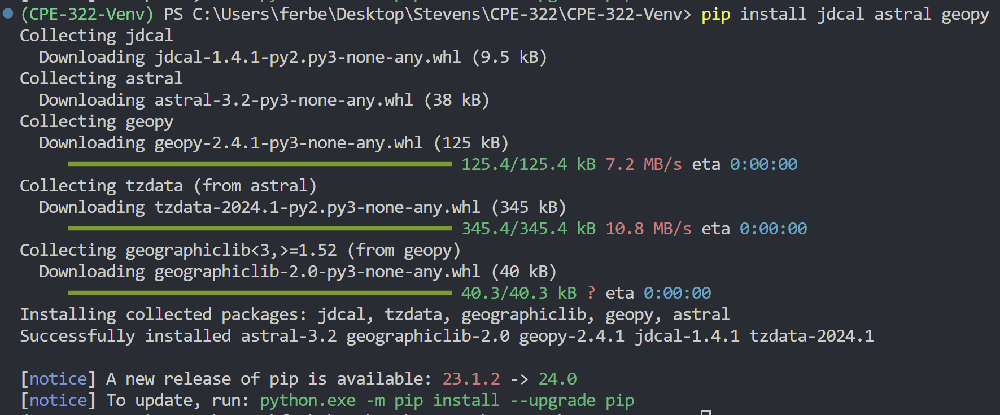
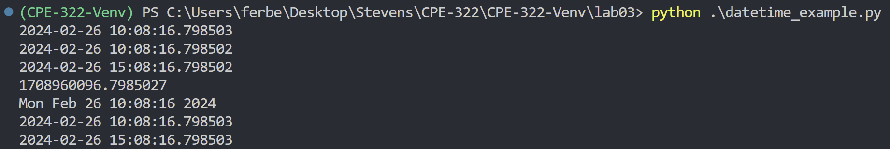
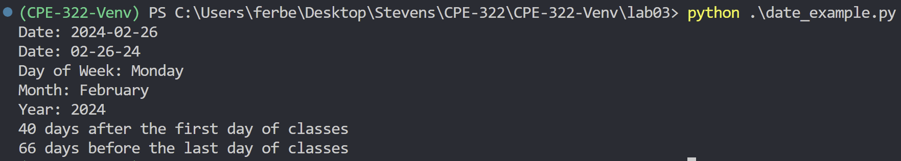
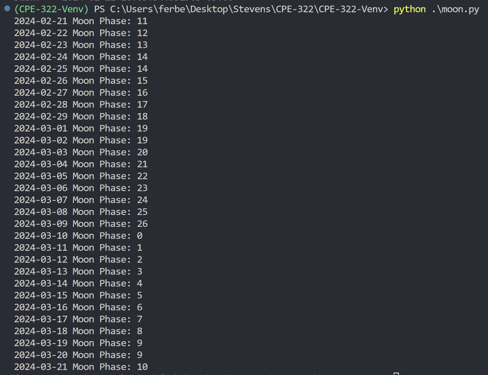
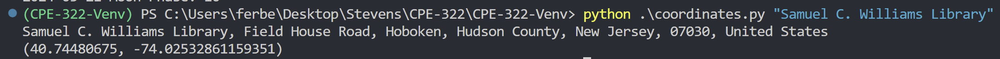
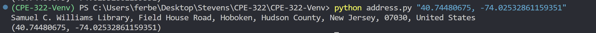
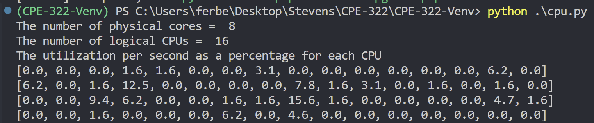
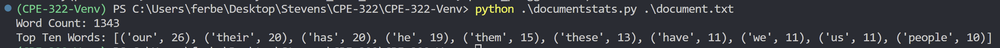

# CPE 322 - Lab 03

The purpose of this lab is to learn using python packages to run code.

## Installing Packages



## Running Python Files

```$ python julian.py```


```$ python date_example.py```


```$ python datetime_example.py```



```$ python time_example.py```



```$ python sun.py "New York"```


```$ python moon.py```



```$ python coordinates.py "Samuel C. Williams Library"```



```$ python address.py "40.74480675, -74.02532861159351"```



```$ python cpu.py```



```$ python battery.py```


```$ python documentstats.py document.txt```


