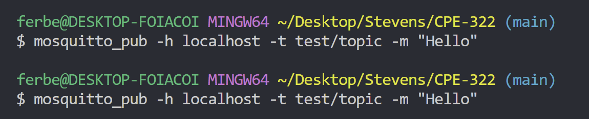
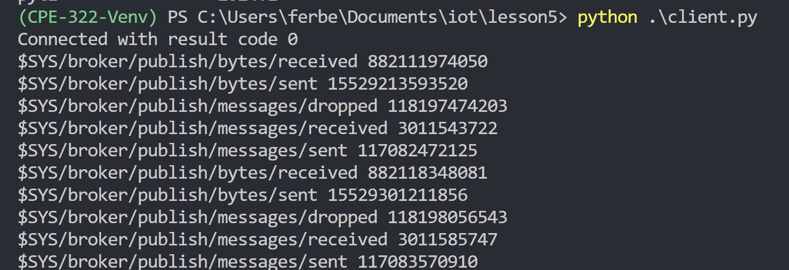
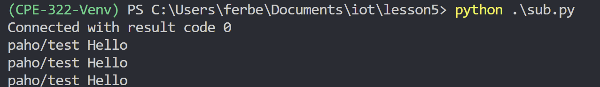
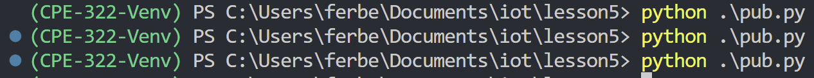
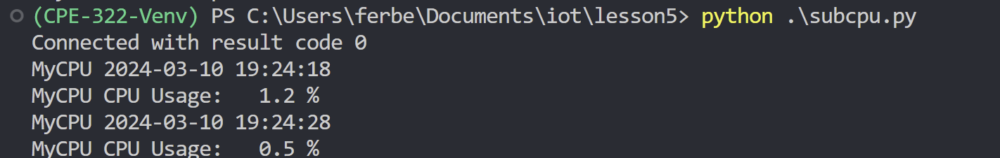
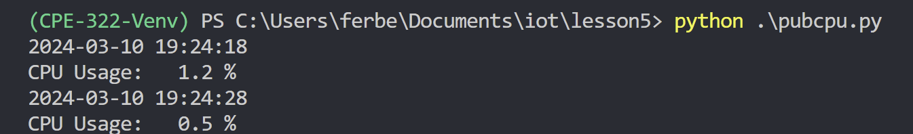

# CPE 322 - Lab 05

The purpose of this lab is to learn about Paho and MQTT

## Installing Packages

Installing the 2.0.0 package in the image above lead to an error about the client class. Ran `$ pip install paho-mqtt==1.6.1` to get a previous version that worked.

## Eclipse Mosquitto and Eclipse Paho

- Terminal 1:

- Terminal 2:

- Terminal 1 (sub)

- Terminal 2 (pub)

- Terminal 1 (sub-multiple)

- Terminal 2 (pub-multiple)

- Terminal 1 (subcpu)

- Terminal 2 (pubcpu)

