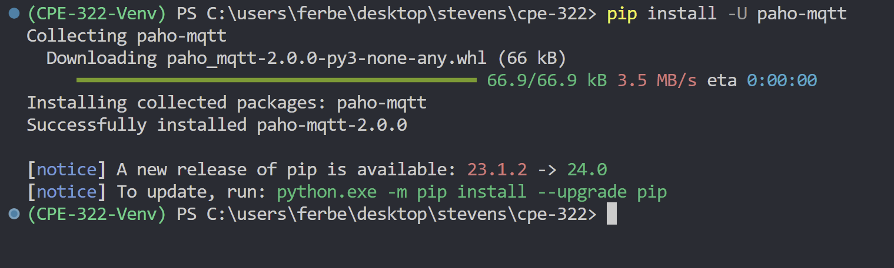
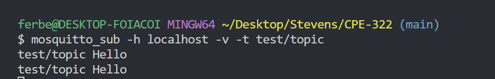
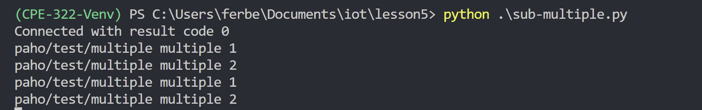

# CPE 322 - Lab 05

The purpose of this lab is to learn about Paho and MQTT

## Installing Packages

## Eclipse Mosquitto and Eclipse Paho

- Terminal 1:

- Terminal 2:

- Terminal 1 (sub)

- Terminal 2 (pub)

- Terminal 1 (sub-multiple)

- Terminal 2 (pub-multiple)

- Terminal 1 (subcpu)

- Terminal 2 (pubcpu)

