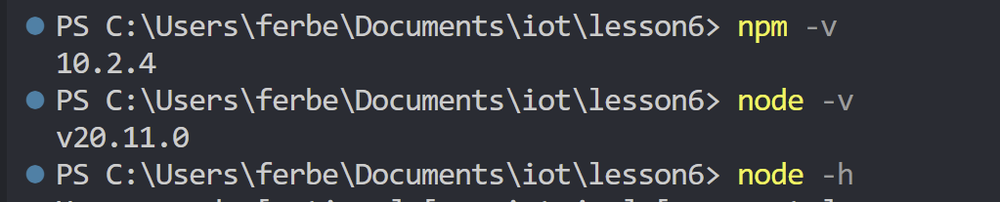
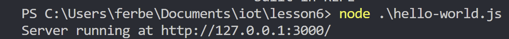
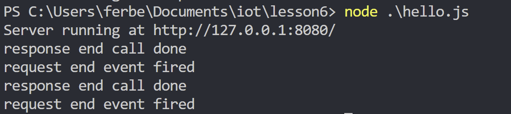
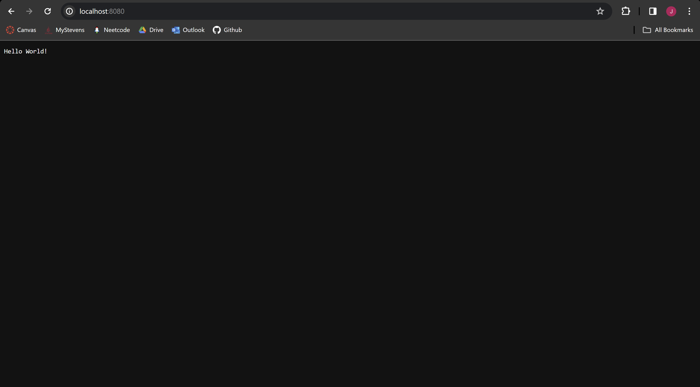
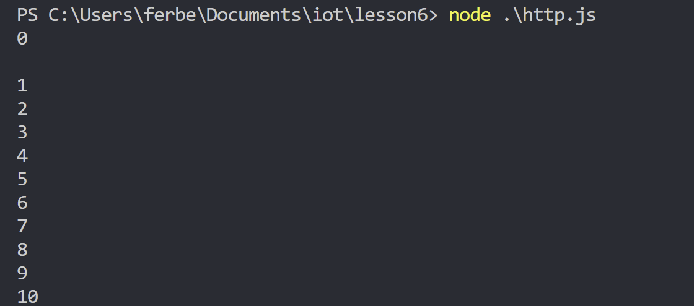
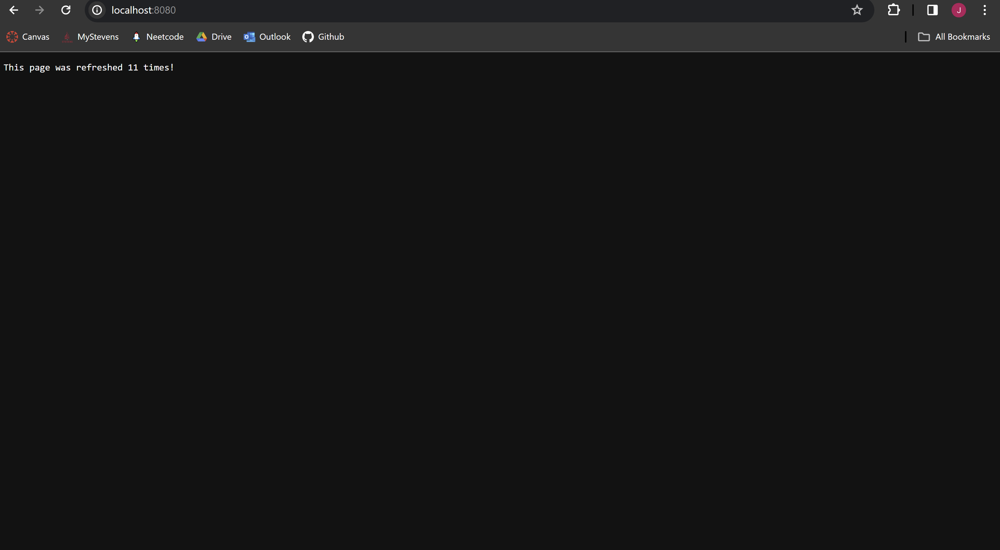
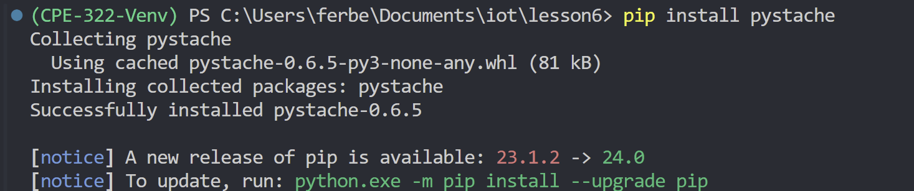
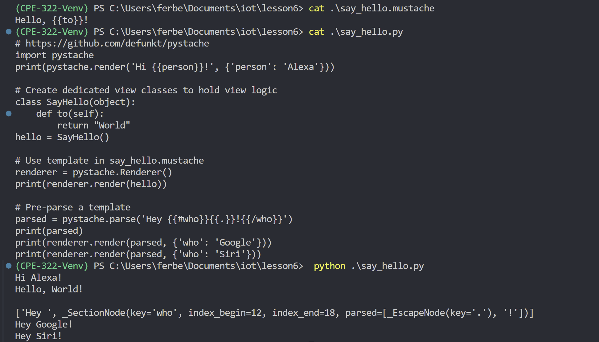

# CPE 322 - Lab 06

This lab will teach us about PyStache and Node.js

## Lab 6A - Node.js

### Node Initialization



### Running Files

```sh
node hello-world.js
```




```sh
node hello.js
```




```sh
node hhtp.js
```




## Lab 6B - Pystache

### Installing Pystache



### Running Files for Pystache


