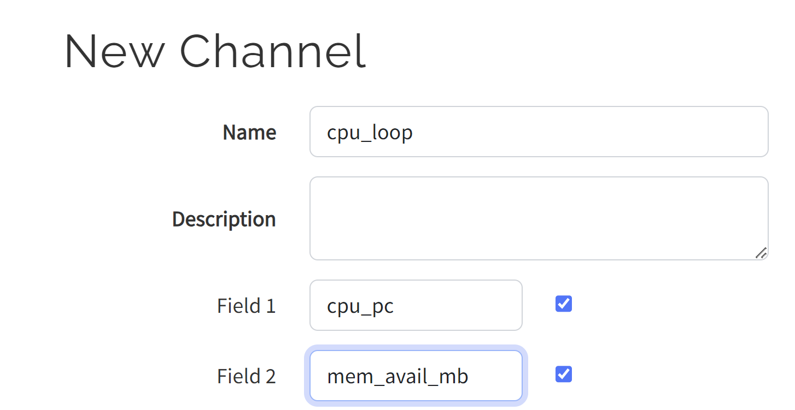
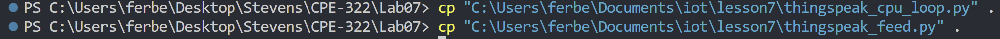
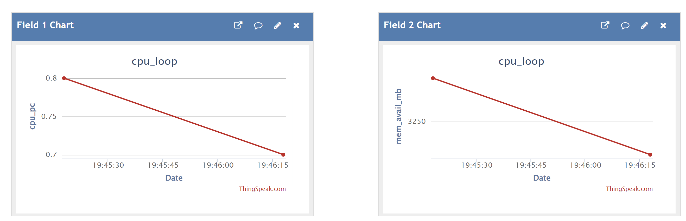
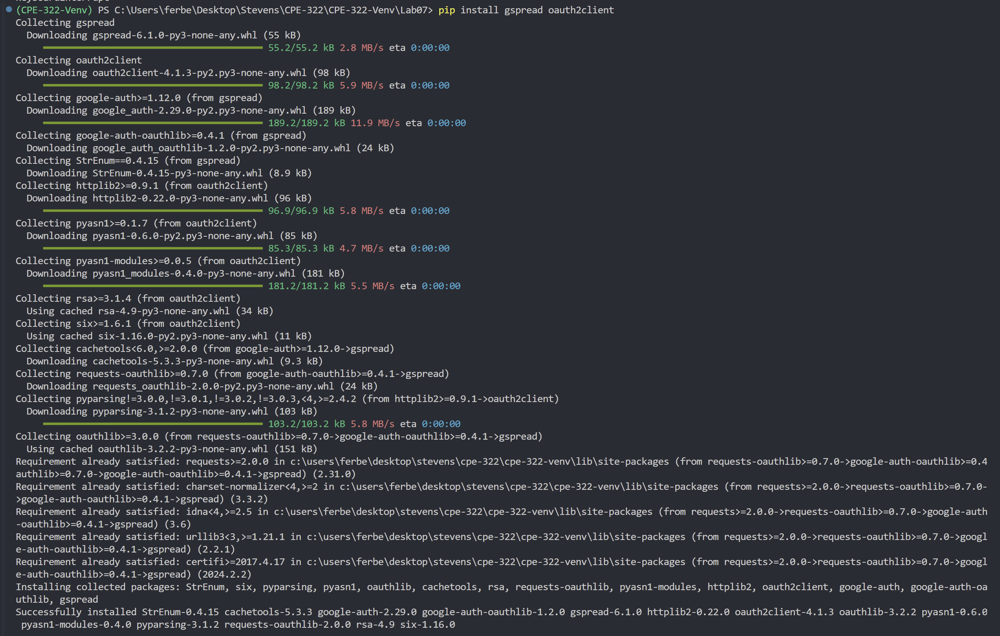
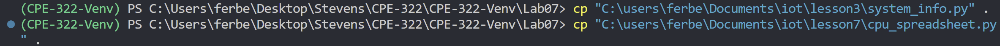
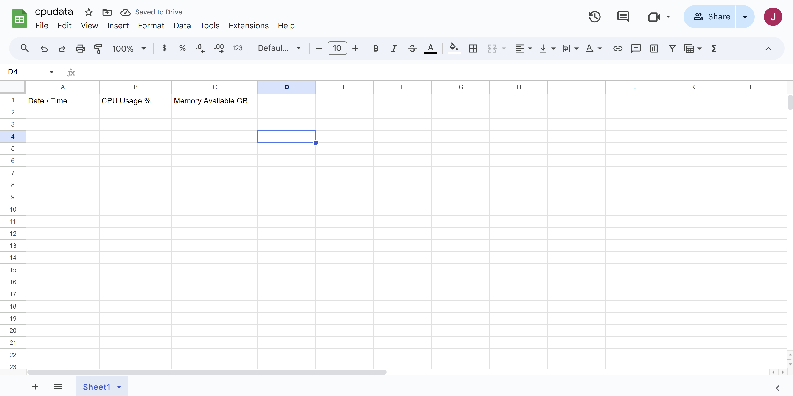
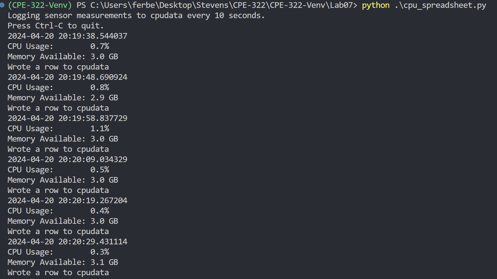
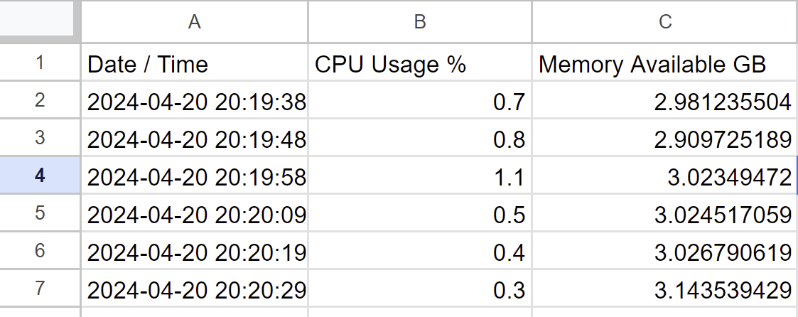

# CPE 322 - Lab 07

The purpose of this lab is to learn about how to use ThingSpeak with Google Sheets

## 7A: Setting up ThingSpeak

New Channel:

Copying files:

After copying the files, I changed the API key in the file itself.

Result of running `thingspeak_feed.py`

## 7B: Google Sheets

Installing required packages:

Copying files:

Then, copied the JSON over from downloads.

New Google Sheets file with correct headers:

Result of running `cpu_spreadsheet.py`:

Table output:

