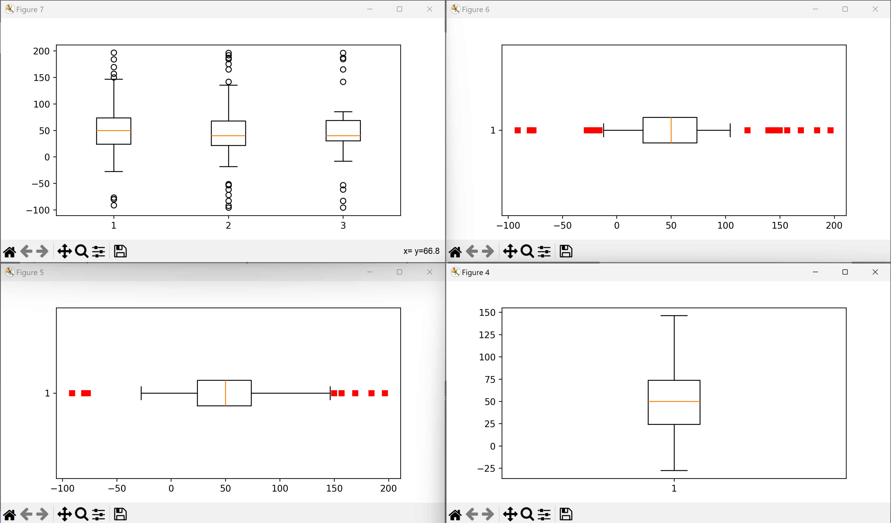
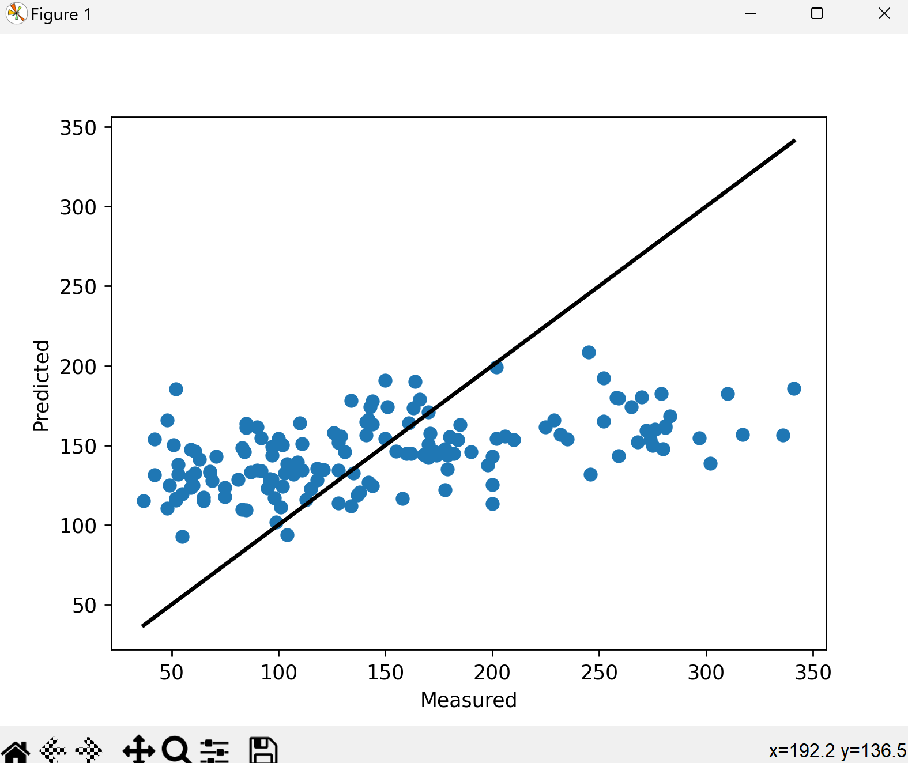

# Lab 08 - Data Analysis

## 8A: Examples

### Downloading Packages

### X-Applications

- ico\

- oclock\

- xcalc\

- xclock\

- xeyes\

- xgc\
- 
- xlogo\

- xman\

### NumPy Array Example

### Review and Run Python Code

- `pyplot_simple.py`\

- `simple_plot.py`\

- `pyplot_formatstr.py`\

- `ticklabels_demo_rotation.py`\

- `pyplot_three.py`\

- `pyplot_two_sublots.py`\

- `pyplot_scales.py` (Error running this file)\

- `pyplot_annotate.py`\

- `major_minor_demo1.py`\

- `legend_demo.py`\

### Histograms, Box Plots, Regression, and Interpolation

- `scatter_demo.py`\

- `histogram_demo_features.py`\

- `pyplot_text.py`\

- `histogram_demo_extended.py`\

- `boxplot_demo.py`\

- `linreg.py`\

- `interpolation.py`\

### Classification, Cross-Validation

- `plot_lda.py`\

- `plot_lda_qda.py` (Error when running the file)\

- `plot_cv_predict.py`\

- `plot_cv_diabetes.py`\

- `traffic.py`\

### Keras and Tensorflow

- `keras_diabetes.py`\

- `keras_first_network.py`\

### Titanic Example

- `titanic_1.py`\

- `titanic_2.py`\

## 8B: Data Analysis

- `plt_final.py`\

- `plt_cv2.py`\

