# Lab 09 - YANG

The purpose of this lab is to learn about pyang and PlantUML.

## Setting up PYANG and PlantUML

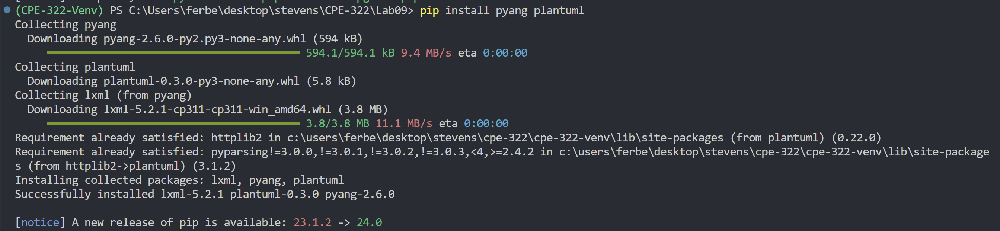
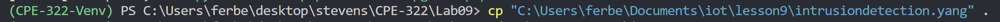

## Running the Files

`cat intrusiondetection.yang`
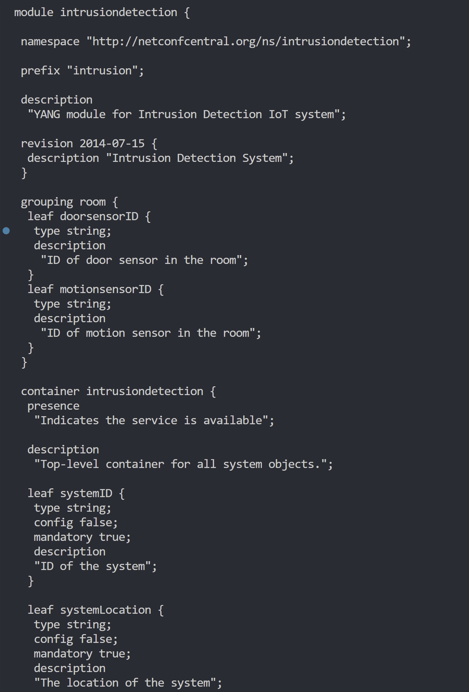
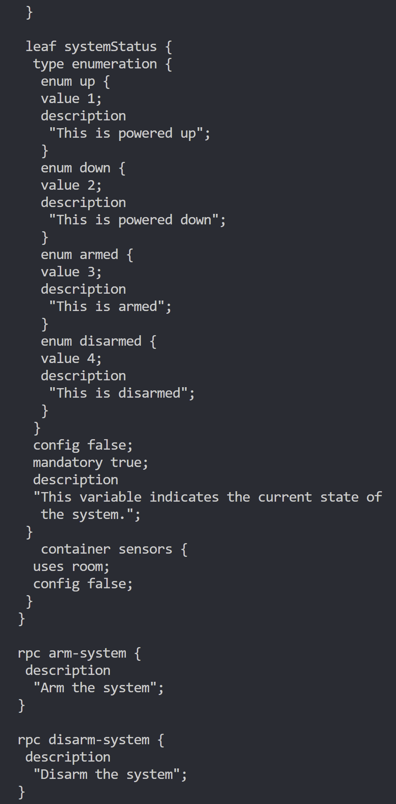
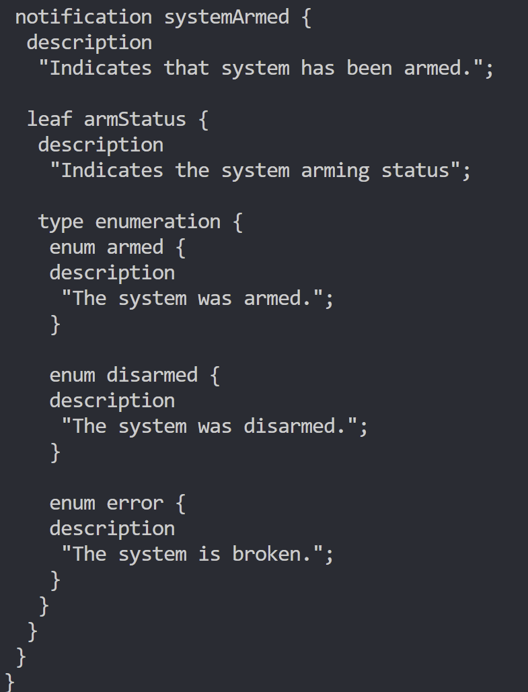
`cat intrusiondetection.yin`
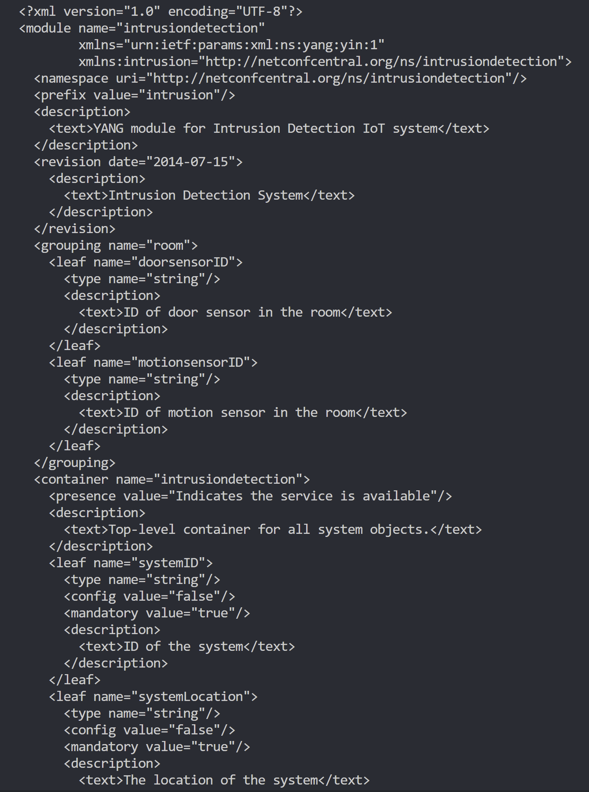
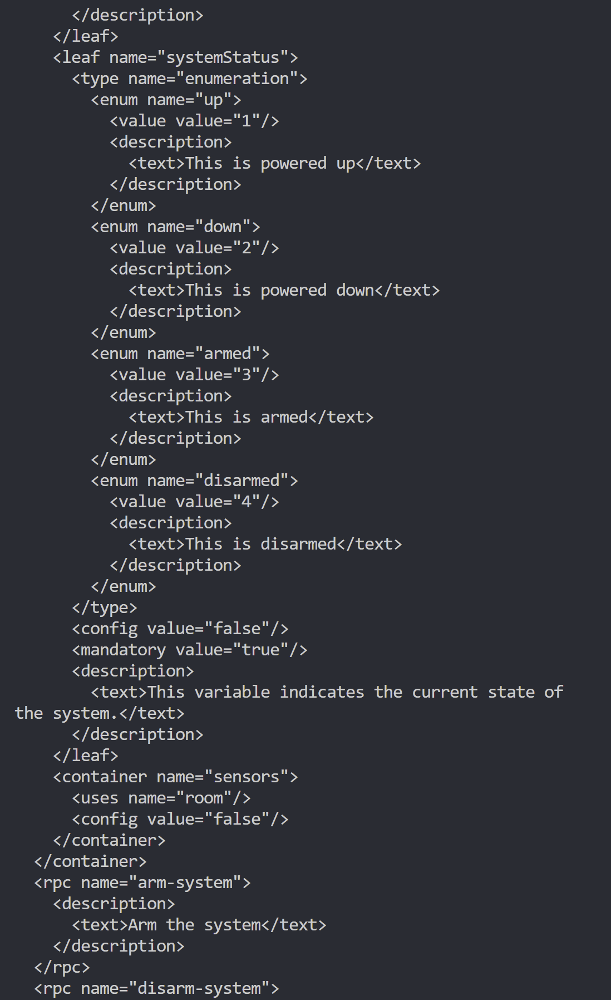
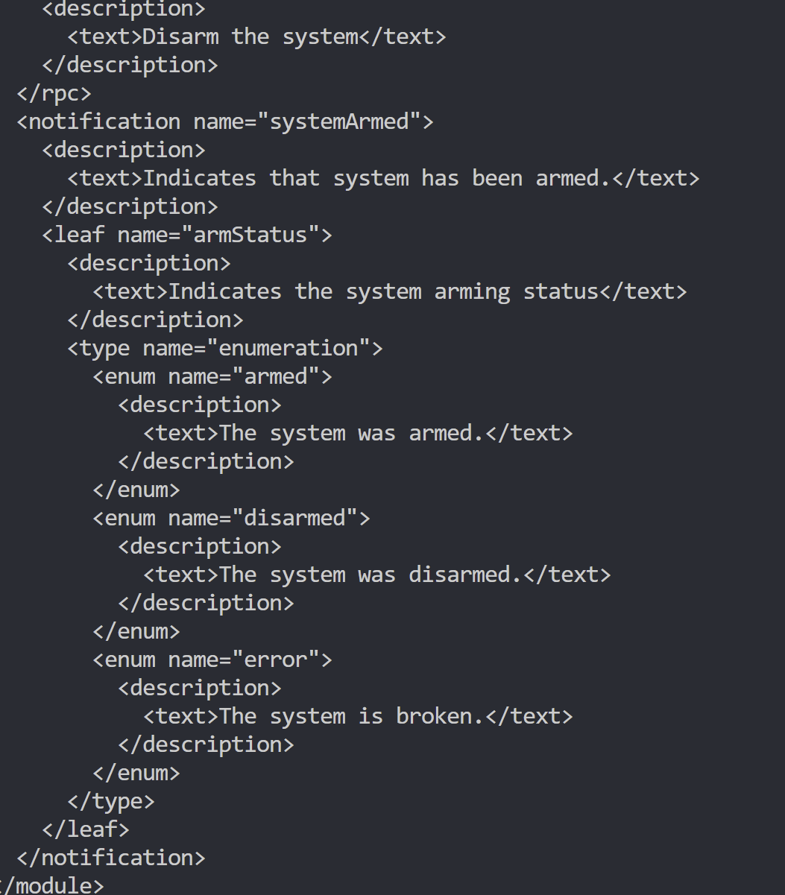
`cat intrusiondetection.uml`
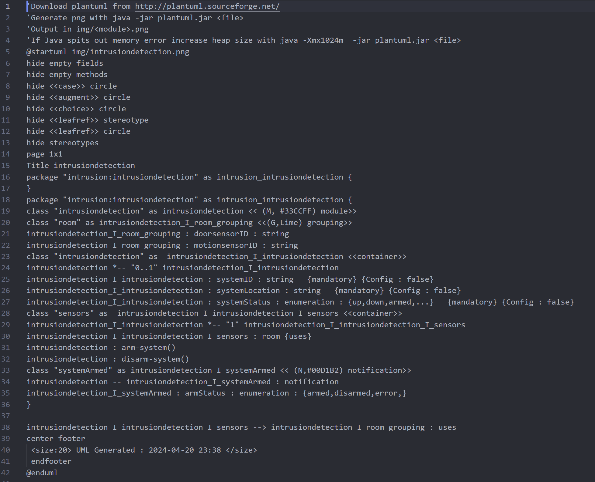

### Result

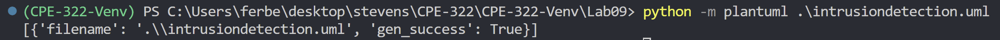
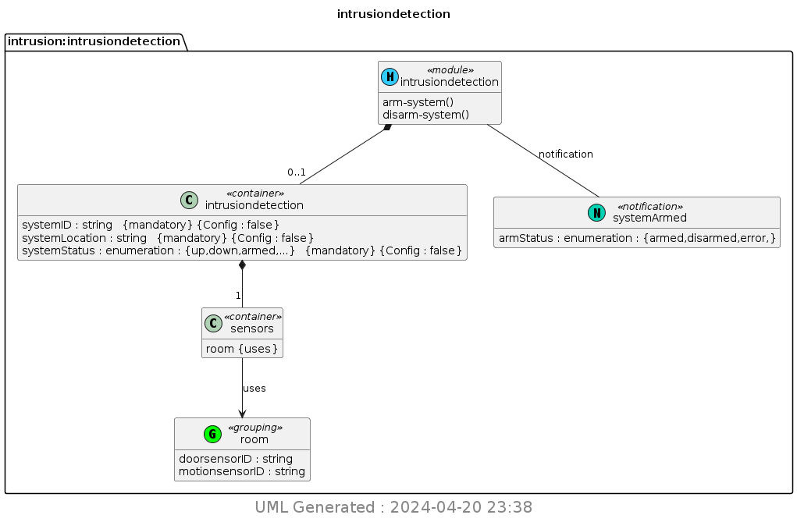
