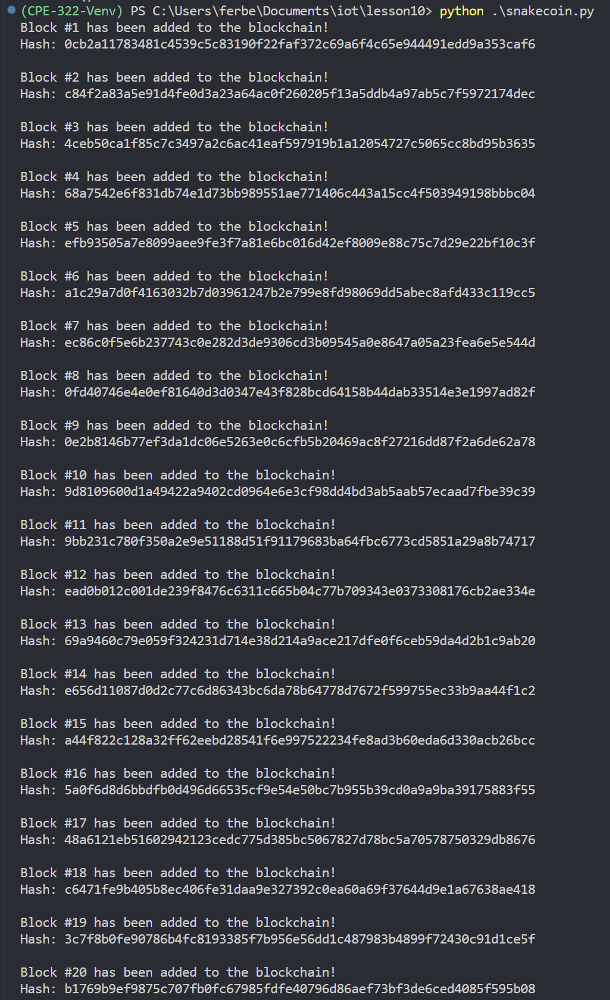

# Lab 10 - Blockchain

The purpose of this lab is to learn about blockchain

## Running the Code

### Hash function with Randomization

### SHA-2 Secure Hash Algorithm

### Built the Tiniest Blockchain

### Bigger tiniest Block Chain

#### Running the server

#### Transaction for New Block

- Terminal 1:\

- Terminal 2:\

- Site:\

#### Python Blockchain App

- Terminal 1:\

- Terminal 2:

Forgot to take image of what was entered. Below is what showed after hitting "Request to mine"

**Final Result**

